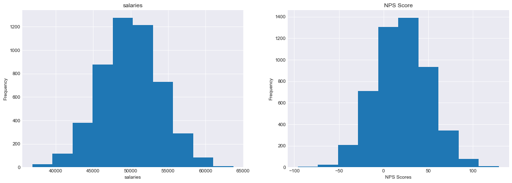
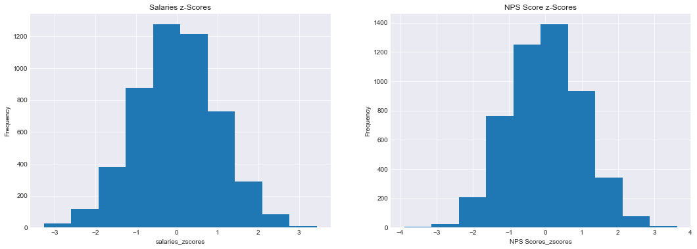
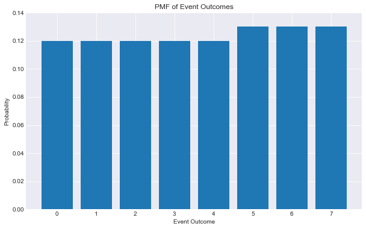
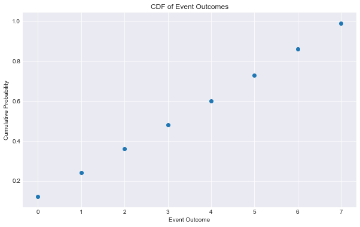
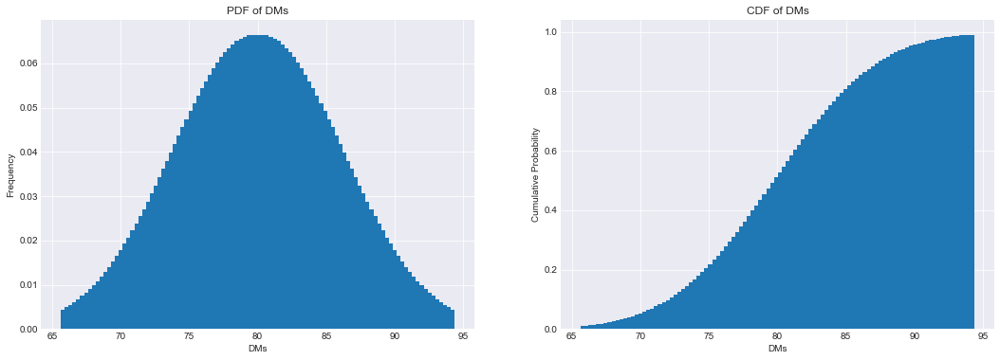

# Objectives
YW
* scrape a website for relevant information, store that information to a dataframe and save that dataframe as a csv file
* load in a dataframe and do the following
    * calculate the zscores of a given column
    * calculate the zscores of a point from a given column in the dataframe
    * calculate and plot the pmf and cdf of another column


```python
import requests
from bs4 import BeautifulSoup
import pandas as pd
import numpy as np
import scipy.stats as scs
import collections
import matplotlib.pyplot as plt
%matplotlib inline
plt.style.use('seaborn-darkgrid')
```

# Part 1 - Webscraping
* use the following url scrape the first page of results
* for each item get the name of the item
* store the names to a dataframe and save that dataframe to csv then display
    * store the dataframe in the `data` folder in the repo
    * name the file `part1.csv` and make sure that when you write it you set `index=False`
* the head of the dataframe

* it should match the following


```python
url = "https://www.petsmart.com/dog/treats/dental-treats/#page_name=flyout&category=dog&cta=dentaltreat"
```


```python
# scrape the names of the items on the webpage above
request = requests.get(url)
```


```python
soup = BeautifulSoup(request.content, 'html.parser')
```


```python
first_container = soup.findAll('div', class_ = 'product-name')
product_names = []
for i in range(len(first_container)):
    prod_name = first_container[i].find('h3')
    str_prod = str(prod_name)
    product_names.append(str_prod.strip('<h3>').strip('</'))
    
product_names
```


    ['Greenies Regular Dental Dog Treats',
     'Greenies Teenie Dental Dog Treats',
     'Greenies Large Dental Dog Treats',
     'Greenies Petite Dental Dog Treats',
     'Authority<sup>®</sup> Dental &amp; DHA Stick Puppy Treats Parsley Mint - Gluten Free, Grain Free',
     'WHIMZEES Brushzees Dental Dog Treat - Natural, Grain Free, 1 Count',
     'Pedigree Dentastix Triple Action Dental Dog Treats - Variety Pack',
     'Pedigree Dentastix Large Dog Treats',
     'Pedigree Dentastix Large Dog Sticks',
     'Authority<sup>®</sup> Dental &amp; DHA Rings Puppy Treats Parsley Mint - Gluten Free, Grain Free',
     'WHIMZEES Veggie Sausage Dog Dental Treat - Natural, 1 Count',
     'Pedigree Dentastix Small/Medium Dog Sticks',
     'Pedigree Dentastix Triple Action Small Dog Treats - Fresh',
     'Greenies Teenie Dog Dental Treats - Blueberry',
     'WHIMZEES Variety Value Box Dental Dog Treat - Natural, Grain Free',
     'Virbac<sup>®</sup> C.E.T.<sup>®</sup> VeggieDent<sup>®</sup> Tartar Control Dog Chews',
     'Yummy Combs<sup>®</sup> Ingenious Flossing Dog Dental Treat - 1 Count',
     'Pedigree Dentastix Mini Dog Sticks',
     'Pedigree Dentastix Large Dog Sticks',
     'Authority Dental &amp; Multivitamin Large Dog Treats Parsley Mint - Gluten Free, Grain Free',
     'Ark Naturals<sup>®</sup> Brushless Toothpaste 4-in-1 Large Dog Dental Chews - 40+ lbs.',
     'Ark Naturals<sup>®</sup> Brushless Toothpaste 4-in-1 Small Dog Dental Chews - 8-20 lbs.',
     'Authority Dental &amp; Multivitamin Small Dog Treats Parsley Mint - Gluten Free, Grain Free',
     'Authority<sup>®</sup> Dental &amp; Multivitamin Medium Dog Treats Parsley Mint - Gluten Free, Grain Free',
     'Milk-Bone Brushing Chew Mini Dental Dog Treats',
     'Authority Dental &amp; Multivitamin Parsley Mint Dog Treat Bites - Gluten Free, Grain Free',
     'Milk-Bone Brushing Chews Large Dental Dog Treats',
     'Greenies Teenie Dental Dog Treats - Fresh',
     'WHIMZEES Hedgehog Dental Dog Treat - Natural, 1 Count',
     'Greenies Regular Dog Dental Treats - Blueberry',
     'WHIMZEES Alligator Dental Dog Treat - Natural, 1 Count',
     'Pedigree Dentastix Dual Flavor Mini Dental Dog Treats',
     'Greenies Petite Dental Dog Treats - Blueberry',
     'WHIMZEES Stix Dental Dog Treat - Natural, 1 Count',
     'WHIMZEES Brushzees Medium Dental Dog Treat - Natural, Grain Free',
     'Authority<sup>®</sup> Dental &amp; DHA Rings X-Small Puppy Treats Parsley Mint- Gluten Free, Grain Free']


```python
# load the data into a dataframe file
df_products = pd.DataFrame(product_names, columns=['Product Name'], dtype=object)
df_products
```


<div>
<style scoped>
    .dataframe tbody tr th:only-of-type {
        vertical-align: middle;
    }

    .dataframe tbody tr th {
        vertical-align: top;
    }

    .dataframe thead th {
        text-align: right;
    }
</style>
<table border="1" class="dataframe">
  <thead>
    <tr style="text-align: right;">
      <th></th>
      <th>Product Name</th>
    </tr>
  </thead>
  <tbody>
    <tr>
      <th>0</th>
      <td>Greenies Regular Dental Dog Treats</td>
    </tr>
    <tr>
      <th>1</th>
      <td>Greenies Teenie Dental Dog Treats</td>
    </tr>
    <tr>
      <th>2</th>
      <td>Greenies Large Dental Dog Treats</td>
    </tr>
    <tr>
      <th>3</th>
      <td>Greenies Petite Dental Dog Treats</td>
    </tr>
    <tr>
      <th>4</th>
      <td>Authority&lt;sup&gt;®&lt;/sup&gt; Dental &amp;amp; DHA Stick P...</td>
    </tr>
    <tr>
      <th>5</th>
      <td>WHIMZEES Brushzees Dental Dog Treat - Natural,...</td>
    </tr>
    <tr>
      <th>6</th>
      <td>Pedigree Dentastix Triple Action Dental Dog Tr...</td>
    </tr>
    <tr>
      <th>7</th>
      <td>Pedigree Dentastix Large Dog Treats</td>
    </tr>
    <tr>
      <th>8</th>
      <td>Pedigree Dentastix Large Dog Sticks</td>
    </tr>
    <tr>
      <th>9</th>
      <td>Authority&lt;sup&gt;®&lt;/sup&gt; Dental &amp;amp; DHA Rings P...</td>
    </tr>
    <tr>
      <th>10</th>
      <td>WHIMZEES Veggie Sausage Dog Dental Treat - Nat...</td>
    </tr>
    <tr>
      <th>11</th>
      <td>Pedigree Dentastix Small/Medium Dog Sticks</td>
    </tr>
    <tr>
      <th>12</th>
      <td>Pedigree Dentastix Triple Action Small Dog Tre...</td>
    </tr>
    <tr>
      <th>13</th>
      <td>Greenies Teenie Dog Dental Treats - Blueberry</td>
    </tr>
    <tr>
      <th>14</th>
      <td>WHIMZEES Variety Value Box Dental Dog Treat - ...</td>
    </tr>
    <tr>
      <th>15</th>
      <td>Virbac&lt;sup&gt;®&lt;/sup&gt; C.E.T.&lt;sup&gt;®&lt;/sup&gt; VeggieDe...</td>
    </tr>
    <tr>
      <th>16</th>
      <td>Yummy Combs&lt;sup&gt;®&lt;/sup&gt; Ingenious Flossing Dog...</td>
    </tr>
    <tr>
      <th>17</th>
      <td>Pedigree Dentastix Mini Dog Sticks</td>
    </tr>
    <tr>
      <th>18</th>
      <td>Pedigree Dentastix Large Dog Sticks</td>
    </tr>
    <tr>
      <th>19</th>
      <td>Authority Dental &amp;amp; Multivitamin Large Dog ...</td>
    </tr>
    <tr>
      <th>20</th>
      <td>Ark Naturals&lt;sup&gt;®&lt;/sup&gt; Brushless Toothpaste ...</td>
    </tr>
    <tr>
      <th>21</th>
      <td>Ark Naturals&lt;sup&gt;®&lt;/sup&gt; Brushless Toothpaste ...</td>
    </tr>
    <tr>
      <th>22</th>
      <td>Authority Dental &amp;amp; Multivitamin Small Dog ...</td>
    </tr>
    <tr>
      <th>23</th>
      <td>Authority&lt;sup&gt;®&lt;/sup&gt; Dental &amp;amp; Multivitami...</td>
    </tr>
    <tr>
      <th>24</th>
      <td>Milk-Bone Brushing Chew Mini Dental Dog Treats</td>
    </tr>
    <tr>
      <th>25</th>
      <td>Authority Dental &amp;amp; Multivitamin Parsley Mi...</td>
    </tr>
    <tr>
      <th>26</th>
      <td>Milk-Bone Brushing Chews Large Dental Dog Treats</td>
    </tr>
    <tr>
      <th>27</th>
      <td>Greenies Teenie Dental Dog Treats - Fresh</td>
    </tr>
    <tr>
      <th>28</th>
      <td>WHIMZEES Hedgehog Dental Dog Treat - Natural, ...</td>
    </tr>
    <tr>
      <th>29</th>
      <td>Greenies Regular Dog Dental Treats - Blueberry</td>
    </tr>
    <tr>
      <th>30</th>
      <td>WHIMZEES Alligator Dental Dog Treat - Natural,...</td>
    </tr>
    <tr>
      <th>31</th>
      <td>Pedigree Dentastix Dual Flavor Mini Dental Dog...</td>
    </tr>
    <tr>
      <th>32</th>
      <td>Greenies Petite Dental Dog Treats - Blueberry</td>
    </tr>
    <tr>
      <th>33</th>
      <td>WHIMZEES Stix Dental Dog Treat - Natural, 1 Count</td>
    </tr>
    <tr>
      <th>34</th>
      <td>WHIMZEES Brushzees Medium Dental Dog Treat - N...</td>
    </tr>
    <tr>
      <th>35</th>
      <td>Authority&lt;sup&gt;®&lt;/sup&gt; Dental &amp;amp; DHA Rings X...</td>
    </tr>
  </tbody>
</table>
</div>


```python
# save the data as a csv file
df_products.to_csv('/Users/jordanrjohnson/DataScienceCourseMaterial/phase_2/topic11-topic13-assessment/data/part1.csv', index=False)
```


```python
# display df.head()
df_products.head()
```


<div>
<style scoped>
    .dataframe tbody tr th:only-of-type {
        vertical-align: middle;
    }

    .dataframe tbody tr th {
        vertical-align: top;
    }

    .dataframe thead th {
        text-align: right;
    }
</style>
<table border="1" class="dataframe">
  <thead>
    <tr style="text-align: right;">
      <th></th>
      <th>Product Name</th>
    </tr>
  </thead>
  <tbody>
    <tr>
      <th>0</th>
      <td>Greenies Regular Dental Dog Treats</td>
    </tr>
    <tr>
      <th>1</th>
      <td>Greenies Teenie Dental Dog Treats</td>
    </tr>
    <tr>
      <th>2</th>
      <td>Greenies Large Dental Dog Treats</td>
    </tr>
    <tr>
      <th>3</th>
      <td>Greenies Petite Dental Dog Treats</td>
    </tr>
    <tr>
      <th>4</th>
      <td>Authority&lt;sup&gt;®&lt;/sup&gt; Dental &amp;amp; DHA Stick P...</td>
    </tr>
  </tbody>
</table>
</div>


# Part 2

load in the csv file located in the `data` folder called `part2.csv`

create a function that calculates the zscores of an array

then calculate the zscores for each column in part2.csv and add them as columns

See below for final result


```python
# load in the dataframe, notice it only contains columns salaries, NPS Score, eventOutcome
data = pd.read_csv('/Users/jordanrjohnson/DataScienceCourseMaterial/phase_2/topic11-topic13-assessment/data/part2.csv')
data.head()
```


<div>
<style scoped>
    .dataframe tbody tr th:only-of-type {
        vertical-align: middle;
    }

    .dataframe tbody tr th {
        vertical-align: top;
    }

    .dataframe thead th {
        text-align: right;
    }
</style>
<table border="1" class="dataframe">
  <thead>
    <tr style="text-align: right;">
      <th></th>
      <th>salaries</th>
      <th>NPS Score</th>
      <th>eventOutcome</th>
    </tr>
  </thead>
  <tbody>
    <tr>
      <th>0</th>
      <td>44112.0</td>
      <td>-7.0</td>
      <td>1</td>
    </tr>
    <tr>
      <th>1</th>
      <td>46777.0</td>
      <td>-12.0</td>
      <td>2</td>
    </tr>
    <tr>
      <th>2</th>
      <td>50013.0</td>
      <td>50.0</td>
      <td>5</td>
    </tr>
    <tr>
      <th>3</th>
      <td>48983.0</td>
      <td>-13.0</td>
      <td>0</td>
    </tr>
    <tr>
      <th>4</th>
      <td>50751.0</td>
      <td>-11.0</td>
      <td>6</td>
    </tr>
  </tbody>
</table>
</div>


```python
def zscores(arr):
    """
    write a function that calculates 
    the zscores of a numpy arr, arr.
    """
    z_scores = []
    mu = np.mean(arr)
    sigma = np.std(arr)
    for x in arr:
        z_scores.append((x-mu)/sigma)
    return np.array(z_scores)
```


```python
# calculate the zscore for each column and store them as a new column with the names used above

# Could use a for loop for this, but there are only 3 columns...
data['salaries_zscores'] = zscores(data['salaries'])
data['NPS Score_zscores'] = zscores(data['NPS Score'])
data['eventOutcome_zscores'] = zscores(data['eventOutcome'])

data.head()
```


<div>
<style scoped>
    .dataframe tbody tr th:only-of-type {
        vertical-align: middle;
    }

    .dataframe tbody tr th {
        vertical-align: top;
    }

    .dataframe thead th {
        text-align: right;
    }
</style>
<table border="1" class="dataframe">
  <thead>
    <tr style="text-align: right;">
      <th></th>
      <th>salaries</th>
      <th>NPS Score</th>
      <th>eventOutcome</th>
      <th>salaries_zscores</th>
      <th>NPS Score_zscores</th>
      <th>eventOutcome_zscores</th>
    </tr>
  </thead>
  <tbody>
    <tr>
      <th>0</th>
      <td>44112.0</td>
      <td>-7.0</td>
      <td>1</td>
      <td>-1.460301</td>
      <td>-0.913613</td>
      <td>-1.103276</td>
    </tr>
    <tr>
      <th>1</th>
      <td>46777.0</td>
      <td>-12.0</td>
      <td>2</td>
      <td>-0.794061</td>
      <td>-1.080776</td>
      <td>-0.668162</td>
    </tr>
    <tr>
      <th>2</th>
      <td>50013.0</td>
      <td>50.0</td>
      <td>5</td>
      <td>0.014927</td>
      <td>0.992046</td>
      <td>0.637182</td>
    </tr>
    <tr>
      <th>3</th>
      <td>48983.0</td>
      <td>-13.0</td>
      <td>0</td>
      <td>-0.242569</td>
      <td>-1.114209</td>
      <td>-1.538391</td>
    </tr>
    <tr>
      <th>4</th>
      <td>50751.0</td>
      <td>-11.0</td>
      <td>6</td>
      <td>0.199425</td>
      <td>-1.047343</td>
      <td>1.072296</td>
    </tr>
  </tbody>
</table>
</div>


# Part 3 
plot 'salaries' and 'NPS Score' on a subplot (1 row 2 columns) 
then repeat this for the zscores

see image below for reference


```python
# plot for raw salaries and NPS Score data goes here
fig, (ax1, ax2) = plt.subplots(1, 2, figsize=(18, 6))

ax1.hist(x=data['salaries'], bins=10)
ax1.set_title('salaries')
ax1.set_xlabel('salaries')
ax1.set_ylabel('Frequency')

ax2.hist(x=data['NPS Score'], bins=10)
ax2.set_title('NPS Score')
ax2.set_xlabel('NPS Scores')
ax2.set_ylabel('Frequency')

plt.show()
```





```python
# plot for zscores for salaries and NPS Score data goes here
fig, (ax1, ax2) = plt.subplots(1, 2, figsize=(18, 6))

ax1.hist(x=data['salaries_zscores'], bins=10)
ax1.set_title('Salaries z-Scores')
ax1.set_xlabel('salaries_zscores')
ax1.set_ylabel('Frequency')

ax2.hist(x=data['NPS Score_zscores'], bins=10)
ax2.set_title('NPS Score z-Scores')
ax2.set_xlabel('NPS Scores_zscores')
ax2.set_ylabel('Frequency')

plt.show()
```





# Part 4 - PMF
using the column 'eventOutcomes'

create a PMF and plot the PMF as a bar chart

See image below for referenc


```python
counter = collections.Counter(data['eventOutcome'])
length = len(data['eventOutcome'])

pmf = []
for key, val in counter.items():
    pmf.append(round(val/length, 2))

outcomes = sorted(counter.keys())

print(outcomes)
print(pmf)
```

    [0, 1, 2, 3, 4, 5, 6, 7]
    [0.12, 0.12, 0.12, 0.12, 0.12, 0.13, 0.13, 0.13]


```python
plt.figure(figsize=(10,6))
plt.bar(outcomes, pmf)
plt.title('PMF of Event Outcomes')
plt.ylim(0, 0.14)
plt.ylabel('Probability')
plt.xlabel('Event Outcome')
plt.show()
```





# Part 5 - CDF
plot the CDF of Event Outcomes as a scatter plot using the information above

See image below for reference 


```python
cdf = np.cumsum(pmf)
cdf_sorted = sorted(cdf)
cdf_sorted
```


    [0.12, 0.24, 0.36, 0.48, 0.6, 0.73, 0.86, 0.99]


```python
plt.figure(figsize=(10,6))
plt.scatter(outcomes, cdf_sorted)
plt.title('CDF of Event Outcomes')
plt.ylabel('Cumulative Probability')
plt.xlabel('Event Outcome')
plt.show()
```





# Level Up:
* using np.where find salaries with zscores <= -2.0

* calculate the skewness and kurtosis for the NPS Score column

* plot the pdf and cdf of a given distribution


```python
# find salaries with zscores <= 2.0 
index_sal = np.where(data['salaries_zscores'] <= 2)
salariesz_2_and_under = []

for index in index_sal:
    salariesz_2_and_under.append(data['salaries'][index])

salariesz_2_and_under
```


    [0       44112.0
     1       46777.0
     2       50013.0
     3       48983.0
     4       50751.0
              ...   
     4995    50580.0
     4996    54526.0
     4997    46135.0
     4998    47223.0
     4999    47913.0
     Name: salaries, Length: 4881, dtype: float64]


```python
# calculate skewness and kurtosis of NPS Score column
skewness = scs.skew(data['NPS Score_zscores'])
kurtosis = scs.kurtosis(data['NPS Score_zscores'])

print('Skewness:', skewness)
print('NPS Scores are slightly skewed to the right.')
print('Kurtosis:', kurtosis)
print('NPS Scores have a Platykurtic distribution, indicating light tails and fewer outliers than a normal distribution')
```

    Skewness: 0.02450527688165853
    NPS Scores are slightly skewed to the right.
    Kurtosis: -0.04212714461681033
    NPS Scores have a Platykurtic distribution, indicating light tails and fewer outliers than a normal distribution


# Plotting a pdf and cdf of a normal distribution
A survey is taken that finds that students send an mean average of 80 DMs a day with a standard deviation of 6 DMS. 


```python
# plot the pdf and cdf of this normal distribution. level up if you can do it in subplots
norm_dist = scs.norm(loc=80, scale=6)
xaxis = np.linspace(norm_dist.ppf(0.01), norm_dist.ppf(.99), 100)
probs = norm_dist.pdf(xaxis)
cum_probs = norm_dist.cdf(xaxis)

fig, (ax1, ax2) = plt.subplots(1, 2, figsize=(18, 6))

ax1.bar(xaxis, probs)
ax1.set_title('PDF of DMs')
ax1.set_xlabel('DMs')
ax1.set_ylabel('Frequency')

ax2.bar(xaxis, cum_probs)
ax2.set_title('CDF of DMs')
ax2.set_xlabel('DMs')
ax2.set_ylabel('Cumulative Probability')

plt.show()
```





```python
# what is the probability of drawing a student that sends at least 82 DMs a day?
prob_82 = 1- norm_dist.cdf(82)
prob_82
```


    0.36944134018176367


A second survey is taken at another bootcamp that shows that students send a mean average of
80 DMs a day, but they have a standard deviation of 9 DMS.  


```python
# What is the difference in the probability of finding a student that sends, at most, 65 DMs a day? 
norm_dist2 = scs.norm(loc=80, scale=9)
prob_difference = prob_82 - (norm_dist2.cdf(65))
prob_difference
```


    0.32165098790894897


# run the cell below to convert your notebook to a README for assessment


```python
!jupyter nbconvert --to markdown assessment.ipynb && mv assessment.md README.md
```
